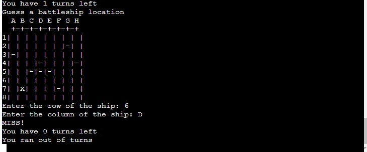

#  Battleships Game
## Introduction
Battleships is a back-end based game built in Python. It is targetted towards users who would like a short fun game to play with a very simple setup.

[View the live website on Heroku](https://battleships-pproject3.herokuapp.com/)
Please note: To open any links in this document in a new browser tab, please press CTRL + Click.

## Table of Contents
* [Strategy Plane](#Strategy-Plane)
* [How To Play](#How-To-Play)
* [Features](#Features)
* [Testing](#Testing)
* [Deployment](#Deployment)

### Strategy Plane
* Battleships Game is intended to be a fun game for individual users to play for short periods of time. The graphical elements and overall design of games immediately provide the user with a visual indicator of what the site is about and set the tone of the interaction.

### How To Play
Game types 
1. Single_player.py 
  - Computer randomly places 5 ships, player has 10 guesses

Legend:
  " " available to guess
  X is hit ship
  "-" is miss

#### Site Goals
* To provide users with a fun and simple game to play

# Features
* Common Features
The game is designed with a columns and row layout in python.

#### Main

#### Correct Answers 

#### Wrong Answers

## Testing
#### Validator Testing

Tested the code in pep8online.com with no major issues
#### Notable Bugs

No bugs noticed so far
## Deployment

* The site was deployed to Heroku pages. The steps to deploy are as follows:
* When you create the app, you will need to add two buildpacks from the _Settings_ tab. The ordering is as follows:

1. `heroku/python`
2. `heroku/nodejs`

* You must then create a _Config Var_ called `PORT`. Set this to `8000`
* Connect your GitHub repository and deploy as normal.
  
The live link can be found here - [Battleships Live Site](https://battleships-pproject3.herokuapp.com/)
### Reference Material
The sites below where used as reference point for Python.
* https://stackoverflow.com/
* https://www.w3schools.com/

